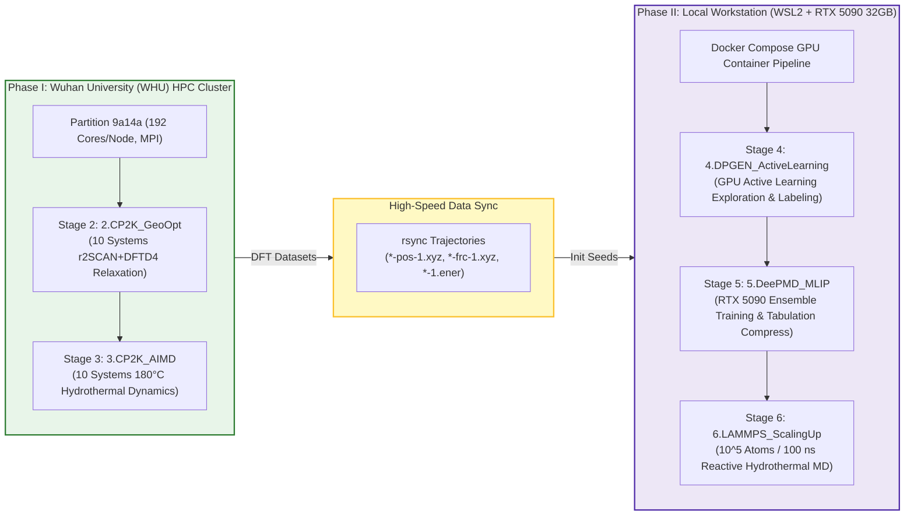
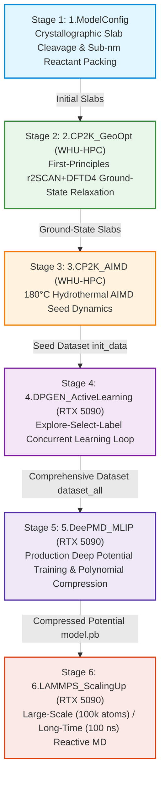

# AI_Phosphogypsum

**AI-empowering upcycling of world-issue phosphogypsum (PG) through multiscale quantum chemistry, active learning (DP-GEN), deep potential neural networks (DeePMD-kit), and large-scale hydrothermal molecular dynamics (LAMMPS).**

[](https://opensource.org/licenses/MIT)

---

## Multiscale Scientific Mission

This repository establishes a closed-loop, multiscale computational framework to uncover the quantum-mechanical and transport mechanisms of **sub-nanometer confined water-mediated ammonium cation ($NH_4^+$) driving the depolymerization of phosphogypsum ($CaSO_4 \cdot nH_2O$) and directional polymerization/precipitation into hydroxyapatite ($Ca_5(PO_4)_3(OH)$) and ammonium sulfate ($(NH_4)_2SO_4$)** under experimentally verified hydrothermal conditions (**180 °C / 453.15 K, 50 bar**).

---

## Hybrid Computing Architecture (WHU-HPC + RTX 5090 WSL2)



---

## 6-Stage Multiscale Workflow Architecture



---

## Repository Structure

```
AI_Phosphogypsum/
├── WorkingFolder/
│   ├── 1.ModelConfig/              # Stage 1: Crystallographic slab cleavage & sub-nm reactant packing
│   ├── 2.CP2K_GeoOpt/              # Stage 2: First-principles (r2SCAN+DFTD4) geometry optimization [WHU-HPC]
│   ├── 3.CP2K_AIMD/                # Stage 3: Hydrothermal (180 °C) AIMD dynamics & seed sampling [WHU-HPC]
│   ├── 4.DPGEN_ActiveLearning/     # Stage 4: DP-GEN active learning exploration & CP2K labeling [RTX 5090 WSL2]
│   ├── 5.DeePMD_MLIP/              # Stage 5: Production Deep Potential training & dp compress [RTX 5090 WSL2]
│   ├── 6.LAMMPS_ScalingUp/         # Stage 6: Large-scale (10^5 atoms, 100 ns) hydrothermal reactive MD [RTX 5090 WSL2]
│   ├── docker-compose.yml          # Containerized GPU runner service definitions (DeePMD, LAMMPS, CP2K)
│   ├── .env                        # Environment configurations for RTX 5090 container runtime (16GB SHM)
│   └── run_rtx5090_workflow.sh     # Master automated pipeline runner for Stages 4 -> 5 -> 6
├── References/                     # Reference literature, structural databases & documentation
├── LICENSE
└── README.md
```

---

## 10 Standard Computational Systems

| System ID | Composition | Atoms | Description |
| :--- | :--- | :---: | :--- |
| **`2.1.1 / 3.1.1`** | $CaSO_4 \cdot 2H_2O$ | 192 | Gypsum dihydrate (020) surface slab |
| **`2.1.2 / 3.1.2`** | $CaSO_4 \cdot 0.583H_2O$ | 384 | Bassanite hemihydrate sub-phase variant |
| **`2.1.2 / 3.1.2`** | $CaSO_4 \cdot 0.5H_2O$ | 180 | Bassanite stoichiometric hemihydrate |
| **`2.1.2 / 3.1.2`** | $CaSO_4 \cdot 0.625H_2O$ | 360 | Intermediate hydrate state |
| **`2.1.3 / 3.1.3`** | $CaSO_4$ | 96 | Anhydrite complete dehydration phase |
| **`2.2.1 / 3.2.1`** | $CaSO_4 \cdot 2H_2O + \text{Reactants}$ | 296 | Dihydrate + confined $NH_4^+ / HPO_4^{2-} / NH_3 / H_2O$ |
| **`2.2.2 / 3.2.2`** | $CaSO_4 \cdot 0.583H_2O + \text{Reactants}$ | 488 | Hemihydrate 0.583 + confined reactants |
| **`2.2.2 / 3.2.2`** | $CaSO_4 \cdot 0.5H_2O + \text{Reactants}$ | 284 | Hemihydrate 0.500 + confined reactants |
| **`2.2.2 / 3.2.2`** | $CaSO_4 \cdot 0.625H_2O + \text{Reactants}$ | 464 | Intermediate 0.625 + confined reactants |
| **`2.2.3 / 3.2.3`** | $CaSO_4 + \text{Reactants}$ | 200 | Anhydrite + confined reactants |

---

## Detailed Hardware Execution Guide

### 1. Phase I: First-Principles Quantum Chemistry on WHU-HPC Cluster
- **Host**: Wuhan University (WHU) High-Performance Computing Center
- **Partition & Account**: `9a14a` / `tangsiqi` (192 MPI Ranks per Node)
- **CP2K Version**: CP2K v2026.2 (`source /scratch/tangsiqi/CP2K_pkg/cp2k-v202602/install/bin/cp2k_env.sh`)
- **Key Parameters**:
  - Exchange-Correlation: Meta-GGA `r2SCAN` + `DFTD4` (`D4_CUTOFF [angstrom] 25.0`, `R_CUTOFF [angstrom] 15.0`)
  - Electrostatic Boundary: 2D Decoupled `PERIODIC XY` + `PSOLVER MT` (`REL_CUTOFF 2.0`)
  - FFT Solver: `EXTENDED_FFT_LENGTHS TRUE` (FFTW3 dynamic factor library supporting 4096+ points)
  - Orbital Transformation: `PRECONDITIONER FULL_ALL`, `MINIMIZER CG` + `LINESEARCH 2PNT`, `ENERGY_GAP 0.001`
  - Wavefunction Extrapolation: `EXTRAPOLATION ASPC (Order 4)`

```bash
# 1. Submit all 10 geometry optimization jobs
cd WorkingFolder/2.CP2K_GeoOpt
./submit_all_jobs.sh

# 2. Submit all 10 hydrothermal (180 °C) AIMD simulation jobs
cd WorkingFolder/3.CP2K_AIMD
./submit_all_jobs.sh

# 3. Monitor running jobs
squeue -u tangsiqi
```

---

### 2. High-Speed Data Sync (WHU-HPC $\rightarrow$ Local RTX 5090 WSL2)
Once AIMD trajectories are generated on WHU-HPC, synchronize the dataset back to the local workstation:

```bash
# Run in local WSL2 terminal:
rsync -avzP \
  --include="*/" \
  --include="*-pos-1.xyz" \
  --include="*-frc-1.xyz" \
  --include="*-1.ener" \
  --include="*-1.cell" \
  --exclude="*" \
  tangsiqi@hpc.whu.edu.cn:/scratch/tangsiqi/AI_Phosphogypsum/WorkingFolder/3.CP2K_AIMD/ \
  WorkingFolder/3.CP2K_AIMD/
```

---

### 3. Phase II: Deep Potential MLIP & LAMMPS on Local RTX 5090 (WSL2)
- **Host**: Windows 11 WSL2 (Ubuntu 24.04) + **NVIDIA GeForce RTX 5090 (32GB GDDR7, Blackwell Architecture)**
- **Runtime**: Industrial Docker Compose GPU containerization (`ghcr.io/deepmodeling/deepmd-kit:3.2.0_cuda129` + local GPU CP2K container)

#### One-Click Automated Master Execution
```bash
cd WorkingFolder

# Execute the complete Stage 4 -> 5 -> 6 pipeline via GPU containerization
./run_rtx5090_workflow.sh --step all --mode docker
```

#### Individual Stage Execution Options
- **Stage 4: Active Learning Iteration**:
  ```bash
  ./run_rtx5090_workflow.sh --step 4 --mode docker
  ```
- **Stage 5: Ensemble Training & Tabulation Compression**:
  ```bash
  ./run_rtx5090_workflow.sh --step 5 --mode docker
  ```
- **Stage 6: 100k-Atom Reactive MD & Kinetics Analysis**:
  ```bash
  ./run_rtx5090_workflow.sh --step 6 --mode docker
  ```

---

## Authors & Acknowledgments

- **Tang Lab**, Wuhan University (WHU).
- **Core Methodology**: Meta-GGA `r2SCAN` + `DFTD4` 2D Martyna-Tuckerman DFT, DP-GEN active learning, DeePMD-kit smooth-edition SE(e2_a) descriptors, and tabulated LAMMPS reactive molecular dynamics.

---

## License

This project is licensed under the MIT License - see the [LICENSE](LICENSE) file for details.
