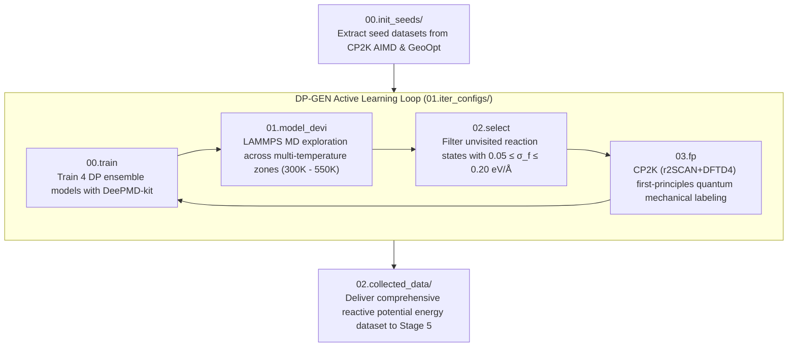

# 4. DP-GEN Active Learning Workflow Center

This directory hosts the **DP-GEN (Deep Potential Generator)** concurrent active learning workflow for the **sub-nanometer confined water-mediated conversion of phosphogypsum ($CaSO_4 \cdot nH_2O$) into hydroxyapatite ($Ca_5(PO_4)_3(OH)$) and ammonium sulfate ($(NH_4)_2SO_4$)**.

---

## Workflow Architecture



---

## Directory Structure

- **`00.init_seeds/`**:
  - `prepare_init_data_from_cp2k.py`: Automated tool to extract coordinates, forces, energies, virials from `3.CP2K_AIMD` and `2.CP2K_GeoOpt` into DeePMD `.npy` / `.raw` format with type map `["Ca", "O", "S", "H", "N", "P"]`.
- **`01.iter_configs/`**:
  - `param.json`: DP-GEN active learning configuration (descriptor `se_e2_a`, multi-temperature scheduling at 300 K, 380 K, 453.15 K / 180 °C, 550 K; CP2K `r2SCAN + DFTD4` labeling parameters).
  - `machine.json`: Machine dispatch environment (GPU / CPU resources).
  - `run_dpgen.sh` / `run_dpgen.bat`: Launch scripts.
- **`02.collected_data/`**:
  - Consolidated repository storing all active learning generated frames.

---

## Quick Start

### 1. Extract Initial Seed Dataset
```bash
cd 00.init_seeds
python3 prepare_init_data_from_cp2k.py
```

### 2. Start Active Learning Iteration
```bash
cd ../01.iter_configs
dpgen run_iter param.json machine.json
```
