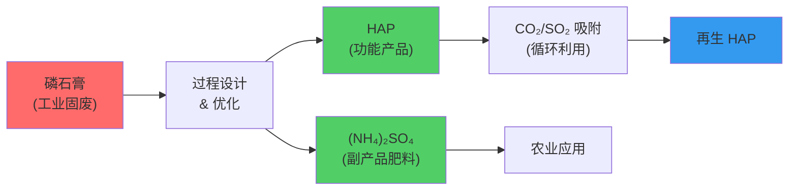
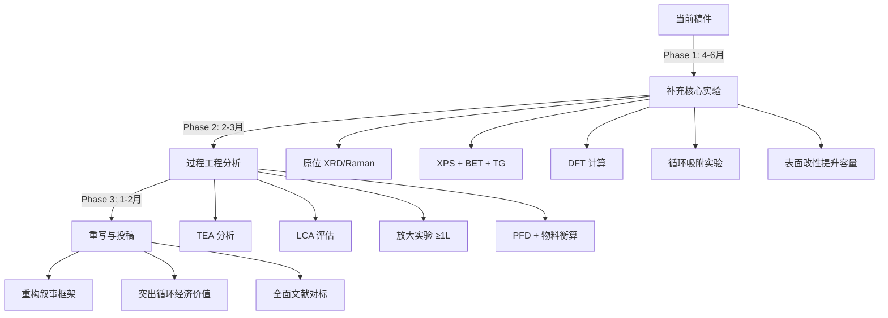

# 磷石膏→羟基磷灰石论文 vs. Nature Chemical Engineering：多维度深度审视

> **目标期刊**：*Nature Chemical Engineering* (Nat. Chem. Eng., EISSN 2948-1198)
> **论文稿件**：[PG to HAP Outline.docx](file:///Users/siqi/Documents/WHU_Office/Manuscript_Collection/Yi_Li_Manuscript2_AI-PG-HAP/Manuscript/PG%20to%20HAP%20Outline.docx)

---

## 一、期刊画像与发表门槛

### 1.1 期刊定位
Nature Chemical Engineering 是 Nature 系列 2024 年 1 月创刊的旗舰期刊，定位为化学工程领域最高影响力平台。核心关注：

| 维度 | 期刊要求 |
|------|----------|
| **创新高度** | "the most significant original research" — 要求领域内变革性突破 |
| **工程深度** | 从基础科学→设计→放大→优化的全链条视角 |
| **社会影响** | 特别欢迎解决 UN 可持续发展目标的工程方案 |
| **学科广度** | 涵盖原料加工/资源回收、反应工程、分离纯化、过程建模与优化、LCA/TEA |

### 1.2 近期已发表论文的水准基线
从最新发表的研究文章看，典型特征包括：

- **"Upcycling nanoscale fragments in industrial waste liquids for aqueous battery electrolytes"** — 废弃物高值转化 + 前沿储能应用
- **"Redox-decoupled electrolysis for direct air capture of CO₂"** — 全新反应工程概念
- **"Scalable large-area ZIF-8 membranes for industrial propylene/propane separations"** — 从实验室到工业放大
- **"Plant-level decarbonization pathways and mitigation costs of global oil refineries"** — 系统性过程分析 + 全球影响
- **"Photoreforming of solid waste on 1 m² scale"** — 从 cm² 到 m² 的规模跨越

> [!IMPORTANT]
> **共性特征**：(1) 概念/方法论上的原创性突破；(2) 从实验室到工业的可扩展性论证；(3) 量化的工程/经济/环境分析；(4) 清晰的比较优势展示。

---

## 二、稿件内容概要

| 要素 | 稿件现状 |3
|------|----------|
| **标题** | Hydrothermal Conversion of Phosphogypsum into Hydroxyapatite and Its Functional Validation for CO₂/SO₂ Removal from Simulated Flue Gas |
| **核心思路** | PG → HAP（水热法）→ CO₂/SO₂ 吸附应用 |
| **磷源/碱源** | (NH₄)₂HPO₄/NH₃·H₂O vs Na₂HPO₄/NaOH vs K₂HPO₄/KOH |
| **优化参数** | pH (9–11), 温度 (120–200°C), 时间 (12–72 h) |
| **最优条件** | pH 11, 160°C, 36 h |
| **表征手段** | XRD, SEM, FTIR, Raman, EDS + mapping |
| **应用验证** | 固定床穿透实验：CO₂ 0.112 mmol/g, SO₂ 0.069 mmol/g |
| **机理** | 碱性水热溶解-沉淀路径（定性描述） |

---

## 三、多维度差距分析

### 维度 1：创新性与概念新颖度

> [!CAUTION]
> **核心问题：研究缺乏变革性的新概念或方法论突破**

| 指标 | 期刊期望 | 稿件现状 | 差距等级 |
|------|----------|----------|----------|
| 概念创新 | 全新反应路径/催化机制/过程范式 | 经典水热溶解-沉淀，方法成熟 | 🔴 严重 |
| 方法论新颖性 | 首次提出的工程方法或框架 | 参数筛选式条件优化 | 🔴 严重 |
| 问题驱动 | 解决领域内长期未解的关键问题 | PG→HAP 已有报道，非新概念 | 🔴 严重 |

**关键缺陷**：
- Mousa & Hanna 和 Bensalah et al. 已经证明了 PG→HAP 的可行性，本稿属于同一思路下的参数拓展
- 水热条件优化（pH/温度/时间）是经典材料合成范式，缺乏方法论创新
- 无新催化剂/添加剂/反应介质/外场辅助等创新元素

### 维度 2：工程深度与可扩展性

> [!WARNING]
> **缺少从实验室到工业的桥接分析**

| 指标 | 期刊期望 | 稿件现状 | 差距等级 |
|------|----------|----------|----------|
| 规模论证 | 放大实验或放大可行性分析 | 250 mL 高压釜，纯实验室规模 | 🔴 严重 |
| 过程经济性 | TEA (Techno-Economic Analysis) | 完全缺失 | 🔴 严重 |
| 生命周期评估 | LCA 或碳足迹分析 | 完全缺失 | 🔴 严重 |
| 物质/能量平衡 | 过程流程图 + 质量/能量衡算 | 完全缺失 | 🟡 中等 |
| 连续化路径 | 连续流反应或工艺设计 | 间歇式，36 h 反应时间 | 🔴 严重 |

**关键缺陷**：
- 36 h 水热反应时间在工业角度极不经济
- 缺乏对副产物（硫酸铵等）的回收/处理设计
- 无能耗、水耗、化学品消耗的量化分析
- Nature Chemical Engineering 明确列出 "Process techno-economic and life-cycle assessments" 为核心范围

### 维度 3：表征深度与机理洞察

> [!WARNING]
> **表征以常规方法为主，缺乏分子/原子尺度机理证据**

| 指标 | 期刊期望 | 稿件现状 | 差距等级 |
|------|----------|----------|----------|
| 原位表征 | in-situ XRD/Raman/NMR 跟踪转化过程 | 仅产物表征，无原位数据 | 🔴 严重 |
| 分子尺度机理 | DFT/MD 计算 + 实验验证 | 纯定性推测，承认"需进一步验证" | 🔴 严重 |
| 中间体识别 | 光谱/质谱捕获中间物种 | 未尝试 | 🔴 严重 |
| NH₄⁺ 作用机制 | 定量阐明 NH₄⁺ 的具体促进机理 | "the molecular-scale role of NH₄⁺ requires further verification" | 🟡 中等 |
| 表面化学 | XPS、BET、Zeta 电位 | 完全缺失 | 🟡 中等 |

**关键缺陷**：
- 机理部分完全依赖推测性语言（"may proceed", "may facilitate"）
- 对于 Nature 系列期刊，定性描述级别的机理远远不够
- 缺乏 XPS（表面化学态）、BET（比表面/孔结构）、TG-DSC（热行为）等关键数据

### 维度 4：应用性能竞争力

> [!CAUTION]
> **吸附性能远低于文献基准，难以支撑"功能性材料"的定位**

| 性能指标 | 本文 PG-derived HAP | 文献典型 HAP | 商业吸附剂/SOTA | NCE 建议发表门槛 | 现状差距 |
|----------|---------------------|--------------|-----------------|------------------|----------|
| **CO₂ 穿透容量** (120°C, ~12% CO₂) | **0.112 mmol/g** (0.49 wt%) | 0.3–1.5 mmol/g | 2–8 mmol/g (胺改性/MOF) | **≥ 1.5–3.0 mmol/g** (或特定工况下表现突出) | 🔴 差 15–30 倍 |
| **SO₂ 穿透容量** (~0.25% SO₂) | **0.069 mmol/g** (0.44 wt%) | 0.5–3.0 mmol/g | 5–15 mmol/g (碱性材料) | **≥ 2.0–5.0 mmol/g** | 🔴 差 30–70 倍 |
| **循环稳定性** | 未测试 | 5–10 次循环 | ≥ 50–1000 次循环 | **≥ 30–50 次循环 (衰减 < 5–10%)** | 🔴 缺失 |
| **抗水汽干扰** (5–15% H₂O) | 未测试 | 常见容量下降 30–60% | 需抗湿/湿促进 | **湿烟气下容量保持率 ≥ 80% 或耐湿稳定性** | 🔴 缺失 |
| **床层利用率** ($q_b / q_s$) | 未定量 | ~40–60% | ≥ 75–85% (陡峭穿透) | **≥ 70–80% (工业空速下)** | 🟡 缺失 |
| **再生脱附能耗** | 未评估 | 未知 | < 2.5–3.5 GJ/t CO₂ | **$Q_{st} = 40–75\text{ kJ/mol}$，脱附温度 ≤ 150°C** | 🔴 缺失 |

#### 附：Nature Chemical Engineering 对气体吸附/分离类成果的具体发表标准
要在 *Nature Chemical Engineering* 上以"气体捕集/分离功能材料与过程"为立论点，必须在以下 5 个方面达到明确的量化与工程标准：

1. **容量与分离系数基准 (Capacity & Selectivity)**
   - 工业烟气（10–15% CO₂）实际工况下，动态穿透工作容量一般要求达到 **1.5–3.5 mmol/g** 以上，或在特定苛刻工况（超高温、强腐蚀、超低分压）下展现出无可替代的选择性（$S_{\text{CO}_2/\text{N}_2} > 100$）。
2. **多组分真实工况抗干扰性 (Flue-Gas Robustness)**
   - 必须包含 **水汽（5–15% H₂O）** 与 **酸性腐蚀性气体（SO₂/NOx）** 共存下的真实穿透测试。需证明在 SO₂ 存在下钙基材料不发生不可逆硫酸盐化中毒，或阐明其抗硫/共脱除机理。
3. **固定床动力学与工业空速验证 (Engineering Kinetics & GHSV)**
   - 实验不能仅在超小流量（如 10 sccm）下进行，需在具有工程意义的体积空速（$\text{GHSV} \ge 3,000–10,000\text{ h}^{-1}$）下获得陡峭的穿透曲线，床层利用率（穿透容量/饱和容量）需达到 **70%–85%**。
4. **长周期循环寿命与再生能耗 (Cycle Durability & Energy Penalty)**
   - 需完成 **≥ 30–50 次连续吸附-脱附循环（TSA/VSA/PSA）**，证明无严重结构坍塌与粉化；脱附温度应尽可能处于 **≤ 120–150°C** 工业中低温余热窗口，吸附热 $Q_{st}$ 需与再生能耗（< 2.5 GJ/t CO₂）挂钩测算。
5. **多维度雷达图对标与 TEA/LCA 综合优势 (Comparative Benchmarking)**
   - 必须与 3–5 种主流材料（如 13X 沸石、CALF-20、Mg-MOF-74、PEI/SiO₂、商业脱硫剂）在容量、吸附速率、再生能耗、原料成本（$/ton）与碳足迹（kg CO₂-eq/kg）上进行全面雷达图对标。若容量中等，则必须证明其**极低固废利用成本与显著负碳效益**具有压倒性工业可行性。

**关键缺陷**：
- 如此低的吸附容量（~0.1 mmol/g），即使用"functional validation"定位也难以让审稿人信服
- 缺乏与成熟吸附剂（CaO、MgO、碱性沸石、胺改性材料）的定量对比
- 缺乏再生/循环实验，工业可行性无法评估
- 吸附机理讨论（Section 3.6.3）过于简略

### 维度 5：数据呈现与统计严谨性

| 指标 | 期刊期望 | 稿件现状 | 差距等级 |
|------|----------|----------|----------|
| 重复实验 | ≥ 3 次平行，误差棒 | 未提及重复 | 🟡 中等 |
| 统计分析 | 方差分析、显著性检验 | 无统计分析 | 🟡 中等 |
| 定量化 | 转化率/产率的精确数值 | 多为定性描述 ("more complete", "less developed") | 🔴 严重 |
| 数据可用性 | FAIR 原则，公开原始数据 | 未提及 | 🟡 中等 |

### 维度 6：写作与叙事框架

| 指标 | 期刊期望 | 稿件现状 | 差距等级 |
|------|----------|----------|----------|
| 叙事结构 | 从问题到解决方案的引人入胜叙事 | 线性参数筛选报告 | 🟡 中等 |
| 广泛受众 | 对非专业读者也有吸引力 | 过于技术化，缺乏大背景 | 🟡 中等 |
| 引言深度 | 清晰定义知识缺口和突破点 | 缺口定义模糊 | 🟡 中等 |
| 结论影响 | 明确声明对领域的重塑意义 | 保守、谦虚的结论 | 🟡 中等 |

---

## 四、综合评估

### 发表可能性评分

```
Nature Chemical Engineering 匹配度: ██░░░░░░░░ ~15-20%
```

| 评估维度 | 权重 | 得分 (1-10) | 加权分 |
|----------|------|-------------|--------|
| 概念创新性 | 30% | 2 | 0.6 |
| 工程深度 | 25% | 2 | 0.5 |
| 机理洞察 | 20% | 3 | 0.6 |
| 应用竞争力 | 15% | 2 | 0.3 |
| 写作质量 | 10% | 5 | 0.5 |
| **合计** | **100%** | — | **2.5/10** |

> [!CAUTION]
> **直接判断**：以当前内容和框架，该稿件与 Nature Chemical Engineering 的发表标准存在 **系统性差距**。即使经过修改润色，也难以在不根本性改变研究内容的情况下达到该期刊门槛。

---

## 五、如果要在 Nature Chemical Engineering 发表：根本性升级方案

### 路径 A：以"循环经济过程设计"为核心重构（推荐）

> 将研究从"材料合成参数优化"升级为"工业固废到功能材料的闭环过程工程"



**需要补充的核心内容**：
1. **完整的过程流程图** (PFD) + 物质/能量衡算
2. **TEA 分析**：生产成本 vs 商业 HAP 价格 vs 磷石膏堆存环保成本
3. **LCA**：碳足迹、资源消耗量化
4. **副产物协同**：(NH₄)₂SO₄ 作为肥料的经济价值
5. **放大实验**：至少 1-5 L 规模验证
6. **连续化方案**：概念设计或初步测试

### 路径 B：以"机理突破"为核心深化

> 阐明 PG→HAP 水热转化的分子尺度机理，建立反应路径图

**需要补充的核心内容**：
1. **原位/时间分辨表征**：原位 XRD + 原位 Raman 追踪转化动力学
2. **DFT 计算**：CaSO₄ 溶解 → Ca²⁺ 释放 → HAP 成核的能量景观
3. **中间体捕获**：淬冷实验 + TEM/HRTEM 捕获成核中间态
4. **NH₄⁺ 机理**：²H/¹⁵N 同位素标记实验定量 NH₄⁺ 的作用
5. **动力学建模**：建立 PG→HAP 转化的反应动力学模型

### 路径 C：以"高性能吸附应用"为核心拓展

> 将 HAP 开发为真正具有竞争力的 CO₂/SO₂ 吸附剂

**需要补充的核心内容**：
1. **表面改性**：胺基修饰、碱金属掺杂提升容量至 > 1 mmol/g
2. **循环稳定性**：≥ 20 次吸附-再生循环
3. **吸附机理**：原位 DRIFTS + DFT 研究 CO₂/SO₂-HAP 表面相互作用
4. **柱动力学建模**：Thomas 模型、Yoon-Nelson 模型拟合
5. **实际烟气测试**：或至少更复杂的模拟气体条件
6. **与基准材料的定量对比**：展示特定场景下的独特优势

---

## 六、更现实的期刊定位建议

鉴于当前稿件的内容体量和研究深度，建议考虑以下梯队：

### 第一梯队（IF 8-12，可直接投稿）
| 期刊 | IF | 匹配理由 |
|------|-----|----------|
| **Journal of Hazardous Materials** | ~13 | 固废利用 + 环境功能材料 |
| **Chemical Engineering Journal** | ~15 | 条件优化 + 应用，期刊接受工程导向稿件 |
| **Journal of Cleaner Production** | ~11 | 磷石膏资源化 + 清洁生产概念 |

### 第二梯队（IF 5-8，较有把握）
| 期刊 | IF | 匹配理由 |
|------|-----|----------|
| **Waste Management** | ~8 | 工业固废转化的直接对口期刊 |
| **ACS Sustainable Chemistry & Engineering** | ~9 | 可持续化学与工程的交叉 |
| **Separation and Purification Technology** | ~9 | 气体净化/分离应用 |

### 第三梯队（IF 3-5，高度匹配）
| 期刊 | IF | 匹配理由 |
|------|-----|----------|
| **Ceramics International** | ~6 | HAP 陶瓷材料合成 |
| **Journal of Environmental Chemical Engineering** | ~8 | 环境化工材料应用 |
| **Materials Chemistry and Physics** | ~5 | 材料合成与性能 |

---

## 七、若坚持投 Nature Chemical Engineering 的最低改进路线图

> [!IMPORTANT]
> 以下是使稿件有「过初筛」可能性的最低要求，实际还需审稿人的善意评价。



### 必做项清单

| 序号 | 任务 | 预计工作量 | 优先级 |
|------|------|-----------|--------|
| 1 | XPS 分析（表面化学态与 S 残留） | 2 周 | ⭐⭐⭐ |
| 2 | BET 分析（比表面积与孔结构） | 1 周 | ⭐⭐⭐ |
| 3 | TG-DSC（热稳定性与转化温度窗口） | 1 周 | ⭐⭐⭐ |
| 4 | DFT 计算（CaSO₄→HAP 转化能量学） | 2-3 月 | ⭐⭐⭐ |
| 5 | 原位 XRD 或 Raman（转化过程跟踪） | 1-2 月 | ⭐⭐⭐ |
| 6 | 表面改性提升吸附容量 | 2-3 月 | ⭐⭐⭐ |
| 7 | 循环吸附-再生实验 (≥ 10 次) | 1 月 | ⭐⭐ |
| 8 | TEA 分析 | 1-2 月 | ⭐⭐⭐ |
| 9 | LCA 评估 | 1-2 月 | ⭐⭐ |
| 10 | 放大实验 (1-5 L) | 1-2 月 | ⭐⭐ |
| 11 | 重构论文叙事 + 重写 | 1-2 月 | ⭐⭐⭐ |

**预估总追加工作量**：6-12 个月

---

## 八、总结与建议

> [!NOTE]
> ### 核心结论
> 
> 当前稿件是一项**扎实的实验研究**，在磷石膏资源化利用领域具有一定的应用价值。然而，与 Nature Chemical Engineering 的发表标准之间存在**系统性的、多维度的差距**：
> 
> 1. **缺乏概念创新** — 水热合成 HAP 并非新方法
> 2. **缺乏工程分析** — 无 TEA/LCA/放大验证
> 3. **缺乏机理深度** — 无计算/原位表征支持
> 4. **应用性能不够竞争** — 吸附容量比基准低 1-2 个数量级
> 
> ### 推荐策略
> 
> **短期（3 个月内）**：补充 XPS/BET/TG，强化定量分析后，投稿 **Chemical Engineering Journal** 或 **Journal of Hazardous Materials**，这些期刊对磷石膏资源化主题高度接受且影响力可观。
> 
> **长期（6-12 个月）**：若团队有计算化学/原位表征/过程分析能力，可按路径 A 重构研究，瞄准 Nature Chemical Engineering 或 **Nature Sustainability**。

---

## 九、详细参考文献列表 (References)

在本审视报告中引用、比对与涉及的关键文献汇总如下，分为五大类提供完整的著者、标题、期刊、卷期及 DOI 信息，供后续论文深化、对标实验设计与投稿策略调整中直接查阅：

### 1. 《Nature Chemical Engineering》基准论文（用于期刊选文水准与工程深度对标）
1. **Chi, X.**, Li, Y., Zheng, Q., Zhang, P., et al. (2026). Upcycling nanoscale fragments in industrial waste liquids for aqueous battery electrolytes. *Nature Chemical Engineering*. [DOI: 10.1038/s44286-026-00424-w](https://doi.org/10.1038/s44286-026-00424-w)  
   *(工业废液固废纳米碎片高值转化为储能电解质的闭环示范)*
2. **Liu, S.**, Xiao, Y. C., Kim, D., et al. (2026). Redox-decoupled electrolysis for direct air capture of CO₂. *Nature Chemical Engineering*, 3(5), 261–271. [DOI: 10.1038/s44286-026-00391-2](https://doi.org/10.1038/s44286-026-00391-2)  
   *(革命性反应工程概念：氧化还原解耦电解用于空气直接碳捕集)*
3. **Lian, H.**, Hua, J., Wang, Q., Song, E., et al. (2026). Scalable large-area ZIF-8 membranes for industrial propylene/propane separations. *Nature Chemical Engineering*. [DOI: 10.1038/s44286-026-00373-4](https://doi.org/10.1038/s44286-026-00373-4)  
   *(实验室膜材料向工业规模大面积放大制备的工程范例)*
4. **Ma, S.**, Meng, J., Lei, T., et al. (2026). Plant-level decarbonization pathways and mitigation costs of global oil refineries. *Nature Chemical Engineering*, 3(5), 298–310. [DOI: 10.1038/s44286-026-00394-z](https://doi.org/10.1038/s44286-026-00394-z)  
   *(工厂级去碳化路径与全生命周期减排成本评估)*
5. **Bin Mohamad Annuar, A.**, Liu, Y., Bhattacharjee, S., et al. (2026). Photoreforming of solid waste on 1 m² scale using single-source precursor-derived co-catalyst films. *Nature Chemical Engineering*, 3(6), 351–362. [DOI: 10.1038/s44286-026-00406-y](https://doi.org/10.1038/s44286-026-00406-y)  
   *(固废光重整从实验室小试到 1 平方米工程放大的范式)*
6. **Pomalaza, G.**, Hickson, M. V., Arts, W., Narmon, A. S., et al. (2026). Assessing the industrial impact of an alternative lactide production method for polylactic acid manufacturing. *Nature Chemical Engineering*. [DOI: 10.1038/s44286-026-00420-0](https://doi.org/10.1038/s44286-026-00420-0)  
   *(替代化学合成路线的工业级影响、经济性与技术评估)*

### 2. 磷石膏水热转化与资源化利用前人研究文献（稿件现状与研究基础对标）
7. **Mousa, S. M.**, & Hanna, A. A. (2013). Synthesis of nano-crystalline hydroxyapatite and ammonium sulfate from phosphogypsum waste. *Materials Research Bulletin*, 48(2), 823–828. [DOI: 10.1016/j.materresbull.2012.11.067](https://doi.org/10.1016/j.materresbull.2012.11.067)  
   *(氨水介质中磷石膏转化制备纳米羟基磷灰石与硫酸铵副产物的经典奠基工作)*
8. **Bensalah, H.**, Bekheet, M. F., Alami Younssi, S., Ouammou, M., et al. (2018). Hydrothermal synthesis of nanocrystalline hydroxyapatite from phosphogypsum waste. *Journal of Environmental Chemical Engineering*, 6(1), 1347–1352. [DOI: 10.1016/j.jece.2018.01.052](https://doi.org/10.1016/j.jece.2018.01.052)  
   *(磷石膏水热转化制备纳米棒状 HAP 中 pH、温度与时间影响机制)*
9. **Tayibi, H.**, Choura, M., López, F. A., Alguacil, F. J., & López-Delgado, A. (2009). Environmental impact and management options of phosphogypsum. *Journal of Environmental Management*, 90(8), 2377–2386. [DOI: 10.1016/j.jenvman.2009.03.010](https://doi.org/10.1016/j.jenvman.2009.03.010)  
   *(磷石膏环境危害、堆存风险与综合利用处置策略综述)*
10. **Yang, J.**, Liu, W., Zhang, L., & Xiao, B. (2009). Preparation of load-bearing building materials from autoclaved phosphogypsum. *Construction and Building Materials*, 23(2), 687–693. [DOI: 10.1016/j.conbuildmat.2008.02.011](https://doi.org/10.1016/j.conbuildmat.2008.02.011)  
    *(磷石膏大宗建筑材料传统利用路径)*

### 3. 羟基磷灰石及固相材料在 CO₂/SO₂ 捕集与烟气净化中的性能基准文献（性能对比与机理）
11. **Diallo-Garcia, S.**, Beniazza, M., Geantet, C., Thomas, K., et al. (2014). Surface chemistry of hydroxyapatites: Carbon dioxide adsorption. *The Journal of Physical Chemistry C*, 118(24), 12744–12752. [DOI: 10.1021/jp5013988](https://doi.org/10.1021/jp5013988)  
    *(羟基磷灰石表面 Ca-OH、PO₄³⁻ 活性位点吸附 CO₂ 的光谱学原位与吸附机理)*
12. **Dunstan, M. T.**, Donat, F., Bork, A. H., Grey, C. P., & Müller, C. R. (2021). CO₂ capture at medium to high temperature using solid oxide-based sorbents: Fundamental aspects, mechanistic insights, and recent advances. *Chemical Reviews*, 121(20), 12681–12745. [DOI: 10.1021/acs.chemrev.1c00100](https://doi.org/10.1021/acs.chemrev.1c00100)  
    *(中高温固相钙基/金属氧化物吸附剂捕集 CO₂ 的权威综述与性能基准)*
13. **Sayari, A.**, Belmabkhout, Y., & Da'na, E. (2012). CO₂ adsorption on amine-functionalized periodic mesoporous silicas: Effect of amine type and loading. *Langmuir*, 28(8), 4241–4251. [DOI: 10.1021/la204771v](https://doi.org/10.1021/la204771v)  
    *(胺官能化改性多孔材料高效捕集 CO₂ 的吸附容量基准 2–8 mmol/g)*
14. **Sun, P.**, Grace, J. R., Lim, C. J., & Anthony, E. J. (2008). Removal of CO₂ and SO₂ in a dual solid-looping system. *Industrial & Engineering Chemistry Research*, 47(19), 7424–7432. [DOI: 10.1021/ie8004547](https://doi.org/10.1021/ie8004547)  
    *(烟气中 CO₂ 与 SO₂ 协同/竞争吸附反应动力学及硫酸化毒化机制)*

### 4. 固定床动态穿透与吸附动力学建模文献（工程分析与柱拟合工具）
15. **Thomas, H. C.** (1944). Heterogeneous ion exchange in a flowing system. *Journal of the American Chemical Society*, 66(10), 1664–1666. [DOI: 10.1021/ja01238a017](https://doi.org/10.1021/ja01238a017)  
    *(固定床连续柱穿透曲线动力学经典 Thomas 模型)*
16. **Yoon, Y. H.**, & Nelson, J. H. (1984). Application of gas adsorption kinetics—I. A theoretical model for respirator cartridge service life. *American Industrial Hygiene Association Journal*, 45(8), 509–516. [DOI: 10.1202/0002-8894(1984)045<0509:aogaki>2.3.co;2](https://doi.org/10.1202/0002-8894(1984)045%3C0509:aogaki%3E2.3.co;2)  
    *(气体吸附动力学与固定床突破时间预测的 Yoon-Nelson 模型)*
17. **Chu, K. H.** (2010). Fixed bed sorption: Setting the record straight on the Bohart–Adams and Thomas models. *Journal of Hazardous Materials*, 177(1–3), 1006–1012. [DOI: 10.1016/j.jhazmat.2010.01.018](https://doi.org/10.1016/j.jhazmat.2010.01.018)  
    *(固定床吸附穿透曲线模型适用性与参数拟合解析)*

### 5. 过程系统工程、技术经济分析（TEA）与生命周期评价（LCA）方法学文献（升级路线图支撑）
18. **Zimmermann, A. W.**, Wunderlich, J., Müller, L., Buchner, G. A., et al. (2020). Techno-Economic Assessment Guidelines for CO₂ Utilization. *Frontiers in Energy Research*, 8, 5. [DOI: 10.3389/fenrg.2020.00005](https://doi.org/10.3389/fenrg.2020.00005)  
    *(Global CO₂ Initiative 推荐的碳捕集与资源化利用标准化 TEA 评价准则)*
19. **Cuéllar-Franca, R. M.**, & Azapagic, A. (2015). Carbon capture, storage and utilisation technologies: A critical analysis and comparison of their life cycle environmental impacts. *Journal of CO2 Utilization*, 9, 82–102. [DOI: 10.1016/j.jcou.2014.12.001](https://doi.org/10.1016/j.jcou.2014.12.001)  
    *(碳利用与资源化过程全生命周期环境影响（LCA）评价方法与基准)*
20. **ISO 14040:2006** (2006). Environmental management — Life cycle assessment — Principles and framework. *International Organization for Standardization*, Geneva, Switzerland.  
    *(生命周期评价国际通行 ISO 标准指南)*


